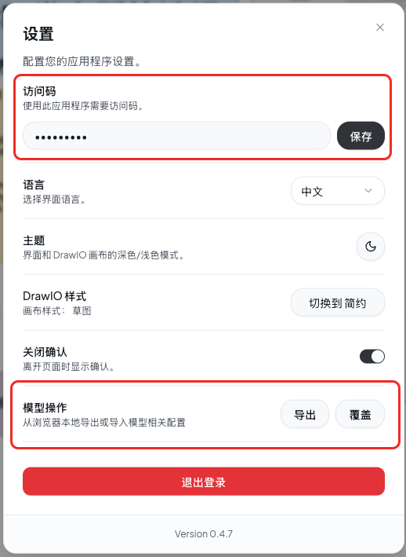

## Next AI Draw NAS

**Next AI Draw NAS** 是基于开源项目 **[Next AI Draw.io](https://github.com/DayuanJiang/next-ai-draw-io)** 的二次开发版本（Fork / Extended Edition），在完整继承原项目设计理念与核心能力的基础上，重点面向 **私有化部署、内网环境和定制化场景** 进行了增强与优化。

> 本项目严格遵循原项目的 **Apache License 2.0** 开源协议，保留原作者署名、版权声明及许可证信息。
> 向原作者 **DayuanJiang** 及其在 AI + draw.io 领域的优秀工作致以诚挚敬意。

---

## 项目定位

Next AI Draw NAS 旨在解决以下场景中的实际需求：

* 企业或团队 **无法使用公有云 Demo**
* 对 **API Key、模型配置、数据安全** 有更高要求
* 希望在 **NAS / 私有服务器 / 内网环境** 中长期稳定运行


### 私有化与部署能力



#### 配置与运维友好性

1. **授权与访问控制**
   新增授权登录能力，更适合私有化部署场景，支持在 **Docker / NAS / 自托管服务器** 等环境中安全运行。

2. **模型配置导入与导出**
   支持模型与 Provider 配置的一键导入与导出，便于配置复用、备份、迁移及版本升级。

3. **消息发送方式管理**
   提供消息发送方式配置，支持「点击发送」与「回车发送」两种模式，满足不同使用习惯与场景需求。

## 部署方式

### docker-compose

```docker-compose 
services:
  next-ai-draw-nas:
    image: ghcr.io/lxchinesszz/next-ai-draw-nas:latest
    container_name: next-ai-draw-nas
    restart: unless-stopped
    ports:
      - "16666:3000"
    environment:
      AI_PROVIDER: openai
      AI_MODEL: qwen3-max
      // 注意换成你自己的key
      OPENAI_API_KEY: sk-7321a270e37131807xxxxxd2dfa02d00d0c31876
      OPENAI_BASE_URL: https://api.qnaigc.com/v1
      ACCESS_CODE_LIST: admin123,admin456
```

### 命令

```bash 
docker run -d -p 3000:3000 \
  -e AI_PROVIDER=openai \
  -e AI_MODEL=kimi-k2-turbo-preview \
  -e ACCESS_CODE_LIST=123456,123213 \
  -e OPENAI_API_KEY=sk-rWCDKoOJxxxxxxxBOGZciLkXwOhmT \
  -e OPENAI_BASE_URL=https://api.moonshot.cn/v1 \
  ghcr.io/lxchinesszz/next-ai-draw-nas:latest
```

### 面向企业与团队使用

* 避免公有 Demo 的流量与使用限制
* 数据仅在本地或私有环境中处理
* 适合作为内部制图与架构设计工具使用

---

## 与原项目的关系说明（重要）

* **本项目不是对原项目的替代**
* **本项目不会移除、覆盖或否认原项目的贡献**
* **所有核心设计与创新均来源于原始开源项目 Next AI Draw.io**

Next AI Draw NAS 的目标是：

> 在尊重原作者成果的前提下，为有私有化需求的用户提供一个更易落地的选择。

---

## 适用人群

* 使用 NAS / 家庭服务器 / 私有云的技术用户
* 对 AI 制图有需求但 **不方便使用公有服务** 的团队
* 架构师、开发者、技术负责人
* 希望在原项目基础上进行二次定制的用户

---

## 许可证与致谢

* 原项目：**Next AI Draw.io**
* 原作者：**DayuanJiang**
* 原许可证：**Apache License 2.0**

Next AI Draw NAS 完全遵循原许可证条款发布，
并对原项目作者及其社区贡献表示由衷感谢。


